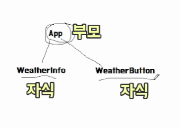

# Weather Open API로 날씨앱 만들기

## 1. Weather API 문서
[Weather open API 문서 링크](https://openweathermap.org/api)
- api key를 얻기 위해서 사이트에 회원가입하여 로그인한다.

## 2. Logic
- user는 현재위치의 날씨를 볼 수 있다. (지역, 온도, 날씨, 상태)
- user는 다른 도시의 버튼들을 볼 수 있다.
- user는 다른 도시 버튼을 클릭하면 해당 도시의 날씨 정보를 볼 수 있다.
- user는 데이터가 로딩될 떄 로딩 스피너를 볼 수 있다.

## 3. App과 Component의 관계

- state weather은 App.js에 있고, city weather data는 weatherButton에 있음
- 부모가 자식한테는 Data를 넘길 수 있음
- 자식이 부모한테는 props를 넘길 수 없음
- 해결방법
    - 부모가 모든 함수와 state를 가지게 하고
    - props로 자식에게 넘겨주게 한다.
    - 앱이 모든걸 가지고 있고 필요한 정보는 자식들에게 넘겨준다.
