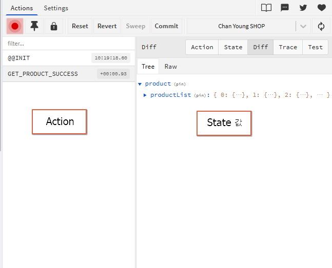

# React Router 이용해서 쇼핑몰 웹사이트 만들기 (Redux-thunk 추가 update) 

## Redux Middleware
- 비동기 작업은 redux로 불가하다.
- Redux middleware는 비동기 작업을 리덕스에서 하기 위함  


- reducer를 가기 전 middleware를 거치게 됨
- Middleware에서 비동기처리를 하고 reducer로 간다.

- Middleware는 라이브러리가 아니고 컨셉. 중간에서 가로채는 개념
- Redux Middleware 종류
	- redux-saga
	- redux-thunk : 우리가 배울 것

## Redux-thunk
[https://github.com/reduxjs/redux-thunk](https://github.com/reduxjs/redux-thunk)
- Redux-thunk 설치
```shellscript
npm install redux-thunk
```  
```javascript
import { createStore, applyMiddleware } from 'redux'
import { thunk } from 'redux-thunk'
import rootReducer from './reducers/index'

const store = createStore(rootReducer, applyMiddleware(thunk))
```  

### Why Do I Need This?
With a plain basic Redux store, you can only do simple synchronous updates by dispatching an action.

### Motivation
- action creators를 만들어서 action 대신 function을 return 한다.
- 내부 함수는 dispatch와 getState값을 파라미터로 받는다.
```javascript
function incrementAsync() {
  return dispatch => {
    setTimeout(() => {
      // Yay! Can invoke sync or async actions with `dispatch`
      dispatch(increment())
    }, 1000)
  }
}
```  

## Reducer combine
- reducer file이 여러개가 되면은 합쳐줘야 한다 -> 합친걸 store에 적용  
  - reducer/index.js 에서 합치는 작업을 한다.  
  - [https://redux.js.org/api/combinereducers](https://redux.js.org/api/combinereducers)
  - reducer/index.js
  ```javascript
    import { combineReducers } from "redux";
    // 합치고 싶은 reducer 들고옴
    import authenticateReducer from "./authenticateReducer";
    import productReducer from "./productReducer";

    export default combineReducers({
        auth : authenticateReducer,
        product : productReducer
    });
  ```
  - redux/store.js
  ```javascript
  import { createStore, applyMiddleware } from "redux";
  import { thunk } from "redux-thunk";
  import rootReducer from "./reducers"
  // reducers 까지만 경로 잡아도 자동으로 index.js 읽어옴

  let store = createStore(rootReducer, applyMiddleware(thunk));

  export default store;
  ```
  - reducer를 combine한 후에는 reducer에 접근할 때(useSelector) 어떤 reducer의 state를 읽을지 정해줘야 함 
  ```javascript
  const productList = useSelector(state => state.product.productList);
  ```

## Redux DevTools
- 크롬 확장자에서 받기 [https://chromewebstore.google.com/detail/redux-devtools](https://chromewebstore.google.com/detail/redux-devtools/lmhkpmbekcpmknklioeibfkpmmfibljd?hl=ko&pli=1)
- devtools 이용 npm module download [https://github.com/reduxjs/redux-devtools](https://github.com/reduxjs/redux-devtools/tree/main/extension#installation)
```shell script
npm install --save @redux-devtools/extension
```
```javascript
import { createStore, applyMiddleware } from 'redux';
import { composeWithDevTools } from '@redux-devtools/extension';

const store = createStore(
  reducer,
  composeWithDevTools(
    applyMiddleware(...middleware),
    // other store enhancers if any
  ),
);
```




## Step
1. 전체 상품 페이지, 로그인 페이지, 상품 상세 페이지 => 총 3개 페이지  
2. 전체 상품 페이지에서는 전체 상품을 볼 수 있다.
3. 로그인 버튼을 누르면 로그인 페이지가 나온다.  
4. 상품 디테일을 눌렀으나, 로그인이 안되었으면 로그인 페이지가 먼저 나온다.  
5. 로그인이 되어있으면 상품 디테일 페이지를 볼 수 있다.  
6. 로그아웃 버튼을 클릭하면 로그아웃이 된다.  
7. 로그아웃이 되면 상품 디테일 페이지를 볼 수 없다. 다시 로그인 페이지가 나온다.  
8. 로그인을 하면 로그아웃이 보이고 로그아웃을 하면 로그인이 보임  
9. 상품을 검색할 수 있다.  


