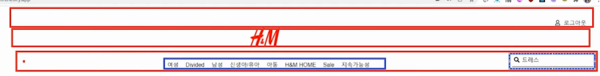

# React Router 이용해서 쇼핑몰 웹사이트 만들기

## Step
1. 전체 상품 페이지, 로그인 페이지, 상품 상세 페이지 => 총 3개 페이지  
1-1. navigation bar(Navbar) 만들기  

	- `
` 3개
	- 1번 `
`에는 아이콘, 로그인/아웃 버튼
	- 2번 `
`에는 HNM 로고
	- 3번 `
`에는 카테고리, 검색창
	- [icon 구하는 웹사이트 : fontawesome/react](https://docs.fontawesome.com/v5/web/use-with/react)
2. 전체 상품 페이지에서는 전체 상품을 볼 수 있다.
3. 로그인 버튼을 누르면 로그인 페이지가 나온다.
4. 상품 디테일을 눌렀으나, 로그인이 안되었으면 로그인 페이지가 먼저 나온다.
5. 로그인이 되어있으면 상품 디테일 페이지를 볼 수 있다.
6. 로그아웃 버튼을 클릭하면 로그아웃이 된다.
7. 로그아웃이 되면 상품 디테일 페이지를 볼 수 없다. 다시 로그인 페이지가 나온다.
8. 로그인을 하면 로그아웃이 보이고 로그아웃을 하면 로그인이 보임
9. 상품을 검색할 수 있다.