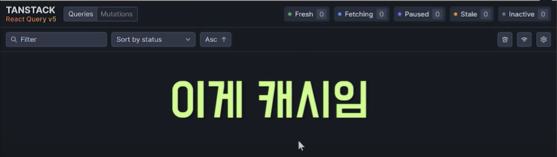
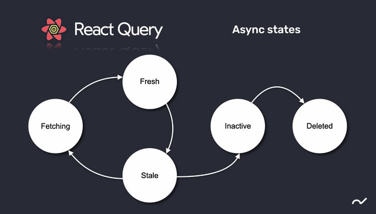

# React-Query (v5)
[https://tanstack.com/query/latest/docs/framework/react/overview](https://tanstack.com/query/latest/docs/framework/react/overview)
- Powerful asynchronous state management : 비동기 상태 관리를 겁나 파워풀하게 해주겠다.  

- React 상태관리  
    - 지역상태 : component 내에서 쓰는 useState같은 상태
    - 전역상태 : 전체에서 쓰이는 상태, 웹사이트 테마, 색, 유저정보 등
    - 서버상태 : api 통신할 때 필요한 상태들 (서버에서 받은 데이터, isLoading, error 등)  

- react query는 특히 `서버상태`를 관리
- 지역상태 관리에는 react query는 애매함  

- 장점
1. 코드가 단순해진다.
2. 캐쉬 관리 : 서버의 부하를 줄여줌 / 서버에 요청을 할지 말지도 상태를 만들어 줄 수 있다.
3. 서버상태와 전역상태 분리 (단점일수도?)

- 설치
```shell script
npm i @tanstack/react-query
```
- 사용
```javascript
import { QueryClient, QueryClientProvider } from '@tanstack/react-query';

const root = ReactDOM.createRoot(document.getElementById('root'));
const QueryClient = new QueryClient()
root.render(
  <QueryClientProvider client={queryClient}>
    <App />
  </QueryClientProvider>
);
```

## react-query devTools
```shell script
npm i @tanstack/react-query-devtools
```
```javascript
import { ReactQueryDevtools } from '@tanstack/react-query-devtools'

function App() {
  return (
    <QueryClientProvider client={queryClient}>
      {/* The rest of your application */}
      <ReactQueryDevtools initialIsOpen={false} />
    </QueryClientProvider>
  )
}
```


- 캐쉬관리 공간
- 사진 속 공간에 뜨는 정보가 캐쉬에 있다는 의미

---
## useQuery
```javascript
import { useQuery } from '@tanstack/react-query'

const {isLoading, data, isError, error} = useQuery({
    queryKey: ['posts'],
    queryFn: () => {
        return axios.get('http://localhost:3004/posts')
    },
    retry: 1, // api 호출 실패 시 1번 더 재시도
    select: (data) => { // 원하는 값을 가져오기
      return data.data;
    },
    gcTime: 5000, // 5초 후 캐쉬 비우기 (단위 : ms)
});
console.log(data, isLoading);
console.log(isError, error);
```
- api 호출 각각에 이름을 정해줄 수 있다. -> queryKey
  - 각 호출의 이름이 unique해야 한다.
- 컴포넌트가 호출될 때 자동으로 useQuery 호출 됨
- api 호출 실패 시 3번 더 시도함 : retry 기능
  - 기본 재시도 횟수는 3번
  - 몇 번 더 시도할 지 횟수 지정 가능

### 캐쉬 관리
- api를 호출할 때 캐쉬에 있는지 확인 후 캐쉬에 있으면 로딩없이 가져옴 그 후 fetch 시도.
- 유저 경험이 훨씬 더 증가
- 캐쉬 수명도 조절 가능
  - `gcTime: 5000, // 5초 후 캐쉬 비우기`
  - react-query v5는 gcTime, 하위버전은 cacheTime이라고 한다.
  - geTime 기본값(지정 안했을시) : 5분

### API 호출 통제
- 캐쉬를 보여주는 동안 api 호출에 대한 것도 통제 가능
  - ex) 3초에 한번씩 api 호출 등



- fetching : api가 호출되고 있을 때
- 데이터 상태 2가지
  - fresh : 데이터가 막 왔을 때 : api 호출 안함(fetch 안함)
  - Stale : 데이터의 유통기한이 끝남 : fetch 함
- fresh 상태를 길게 주면 api 호출을 필요할 때만 할 수 있다.  
- fresh의 기본값은 0, staleTime의 기본값 0
- inactive : cache는 이때부터 카운팅 됨  
- api 호출 한 번 하고 안해도 될 경우, 자주 호출하지 않는 api 경우 ex.페이지의 카테고리
```javascript
// 생략
staleTime: 10000, // 10초간 api 호출 안함
```
- staleTime보다 gcTime이 짧은 경우에는?
  - 남은 gcTime동안은 cache가 없다는 것.
  - staleTime 상관없이 cache가 없으면 api 호출한다.
  - 따라서 staleTime > gtTime 해야 상도덕이다.  
- api 호출 주기 정하기
```javascript
refetchInterval: 3000, // 3초마다 api 호출
```
- 컴포넌트를 다시 들어올 때 api 호출 여부
  - 기본값 true
  - stale보다 강력한 느낌, 한 번 부르고 안부를꺼다하면 false
```javascript
refetchOnMount: false
```
- 윈도우에서 사용중인 창으로 돌아오면 자동 api 호출
  - 사용자에게 매번 새로운 데이터를 빨리 보여줘야 할 때 사용
```javascript
refetchOnWindowFocus: true
```
- 다른 여러가지 옵션들은 공식문서에서 찾을 수 있다.  
- 버튼을 클릭할 때 api가 호출되게 하기
```javascript
const {isLoading, data, isError, error, refetch} = useQuery({
    // 생략
  });
// 생략
<button onClick={refetch}>post리스트 다시 들고오기</button>
```
- 버튼 누르기 전(초기)에는 api 호출 안되고, 버튼 클릭할 때만 api 호출
```javascript
enabled: false // 기본값 true
// ex) 검색조건 있으면 api 호출
enabled: !!keyword // 조건을 써줄 수 있음
```
- Detail api 호출하기
  - ex) posts/1
```javascript
const {isLoading, data, isError, error, refetch} = useQuery({
    queryKey: ['posts', 1], // 보내주고 싶은 값을 queryKey에 넣어줄 수 있음
    queryFn: (queryData) => {
        const id = queryData.queryKey[1];
        return axios.get(`http://localhost:3004/posts/${id}`)
    },
    // 생략
  });

```
