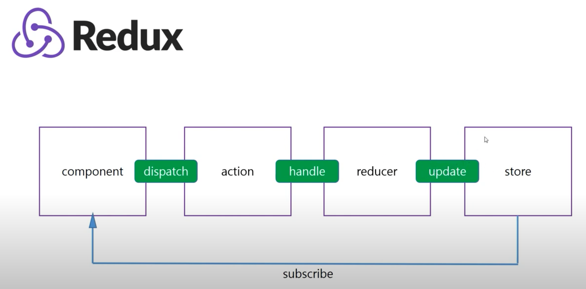

# Redux
- react가 쓸 수 있는 라이브러리 중 하나
- redux는 필수사항은 아니지만 없으면 매우 불편하다.
- 매우 어려움 주의

- redux를 만든 이유?

- react의 불편한 점 : react는 한방향 소통만 가능해서 자식 컴포넌트 끼리는 state공유가 불가하다.
- redux는 store라는 저장소에 state를 저장해 준다. 

- redux를 어려워 하는 이유? 컴포넌트가 store의 값을 바로 바꾸거나 요청하지 못한다.
  

ex) 로그인
- action : 로그인 하기
- reducer : 작업지시 리스트 중에서 골라서 작업 -> store의 값을 바꿔줌
- store : object 타입이라고 보면 됨

- react hook
    - useDispatch : action을 던지는 hook
    - useSelector : store의 값을 가져와서 쓸 때 사용

[Redux 홈페이지](https://redux.js.org/)
```shell script
npm install redux
```
---

# React-Redux
- [React-Redux 링크](https://react-redux.js.org/)
- redux와 별개로 redux가 react에서 잘 쓰이기 위해 필요한 함수들을 모아놓은 package
```shell script
npm install react-redux
```

- `<Provider />` : the Redux store available to the rest of your app, index.js에 적용
```javascript
// 생략
import { Provider } from 'react-redux'
import store from './store'
// 생략

// As of React 18
const root = ReactDOM.createRoot(document.getElementById('root'))
root.render(
  <Provider store={store}>
    <App />
  </Provider>
)
```  
- `createStore` : 현재 deprecated 되어있음, configurestore 쓰는 걸 추천하고 있다.
    - configurestore의 동작원리를 정확히 이해하기 위해서 먼저 알기를 추천.

---

### useDispatch
```javascript
import { useDispatch } from 'react-redux';
// 생략
 const dispatch = useDispatch();
```  
- Action은 단순한 Object(객체)이다.
- dispatch에 Action을 넘겨야 하는데 방법은
```javascript
const dispatch = useDispatch();
// type: action의 이름
// payload : 함수의 매개변수 같은 느낌, 필요한 정보를 보내줄 수 있음
dispatch({type: "INCREMENT", payload:{num: 5}})
```  
- reducer는 자동으로 dispatch가 던진 action을 받아올 수 있음
- reducer 기본 구조  
```javascript
let initialState = {
    level:0
}

function reducer(state=initialState, action) {
    console.log("Action은 뭘까?", action);
    //{type: '@@redux/INITf.1.9.1.f.9'}type: "@@redux/INITf.1.9.1.f.9"[[Prototype]]: Object

    // if문, switch문 등 회사에 따라 사용방법은 다름.
    if(action.type === "INCREMENT") {
        return {
            // store는 reducer의 return값을 적용한다.
            // ...state인 이유 : (만약 state가 여러개이면) 다른 state값은 유지하되, count만 바꾼다는 의미
            // ...spread문법을 통해서 기존 객체 내용을 복사해 새로운 객체에 전달 가능
            ...state, level: state.level + 1
        };
    }
    // store는 return값 필수
    return {...state};
}

export default reducer;
```  
---

### useSelector
- state값 가져와서 쓰고 싶으면 useSelector  
```javascript
import { useSelector } from 'react-redux';
// 생략
 const level = useSelector(state => state.level);
// 생략
<h1>{level}</h1>
```
---

## Redux-Toolkit
[https://redux-toolkit.js.org/](https://redux-toolkit.js.org/)
```shell script
npm install @reduxjs/toolkit
```
- redux-tookit을 설치하면 redux가 자동으로 설치되니 기존 redux 제거해도 됨

```javascript
import { createSlice } from "@reduxjs/toolkit";

const basicSlice = createSlice({
    name: "basic",
    initialState,
    reducers: {
        // reducers는 객체를 받고, 그 객체는 함수로 이루어져 있다.
        // 그 함수는 두 개의 매개변수를 갖는다.
        increment(state, action) {
            // 리턴 없음
            state.level = state.level + 1;
        }
        ,login(state, action) {
            state.id = action.payload.id;
            state.pw = action.payload.pw;
        }
    }
})

console.log("basic slice : " + basicSlice);

export const basicActions = basicSlice.actions;
export default basicSlice.reducer;
```

- `store.js` 에서 `createStore` 지원 안함
- 기존 `createStore`
    - store에 reducer를 보낼 때 combineReducer를 이용해서 보냄
    - thunk 
    - applyMiddlewrea
    - composeWithDevTools  
- 새로운 `configureStore`
    - composeWithDevTools 자동 setup
    - applyMiddlewrea, Thunk 자동 setup
    - combineReducer 자동 setup

```javascript
import { configureStore } from "@reduxjs/toolkit";

const store = configureStore({
    reducer: {
        // combinereducer에서 해주는 것과 같이 넣어줌
        // auth :authenticate
        // product: productReducer

    }
})

export default store;
```

```javascript
// dispatch 사용
import { useDispatch, useSelector } from 'react-redux';
import { basicActions } from './redux/reducer/reducer';

dispatch(basicActions.increment(/*payload에 보낼 꺼 넣어줌*/))
```
---

## createAsyncThunk
- redux의 action type 값을 받고, promise를 return하는 callback 함수를 받는다.
- promise lifecycle action type을 만든다.
  - type의 종류
    - pending : async 시작
    - fulfilled : 성공
    - rejected : 에러
- payloadCreator
    - return promise
    - two arguments
        - args : api 호출에 필요한 정보 받음
        - thunkAPI : api 호출에 필요한 것들 줌 (ex. dispatch, getState 등)

```javascript
// hnm 쇼핑몰 프로젝트에서 productReducer.js
import { createAsyncThunk, createSlice } from "@reduxjs/toolkit";
import axios from "axios";

let initialState = {
    productList: [],
    isLoading: false,
    error: null
}

export const fetchProducts = createAsyncThunk(
    "product/fetchAll",
    async (searchQuery, thunkAPI) => {
        try {
            let url = `https://my-json-server.typicode.com/dlcksdud/REACT/products?q=${searchQuery}`;
            const response = await axios.get(url);
            return response.data; // 데이터를 반환해야 reducer에서 받을 수 있음
        } catch (error) {
            return thunkAPI.rejectWithValue(error.response?.data || error.message);
        }
    }
);

const productSlice = createSlice({
    name: "product",
    initialState,
    reducers: {
        // getAllProducts(state, action) {
        //     state.productList = action.payload.data;
        // }
    },
    extraReducers: (builder) => {
        builder
            .addCase(getProducts.pending, (state) => {
                // 일반적으로 pending 상태에서는 로딩스피너
                state.isLoading = true;
                
            })
            .addCase(getProducts.fulfilled, (state, action) => {
                state.productList = action.payload;
                state.isLoading = false;
            })
            .addCase(getProducts.rejected, (state, action) => {
                // 실패 케이스
                state.isLoading = false;
                state.error = action.payload;

            })
    }
})

export const productActions = productSlice.actions;
export default productSlice.reducer;
```
- `createSlice`에서 
    - `reducers`: 동기적으로 자신의 state를 바꾸는 경우
    - `extraReducers`: 외부 api 등에 의해 호출된 extra한 reducer들, 직접적으로 호출하지 않고 `createAsyncThunk`를 통해서 호출할거기 때문

- 위와 같이 `createAsyncThunk`와 `createSlice`를 함께 써주면 파일 이름도 `productSlice.js`로 해줄 수 있음
    - `productSlice.js`에 `createAsyncThunk`와 `createSlice`가 있으니 `productAction.js`도 필요 없게 됨

