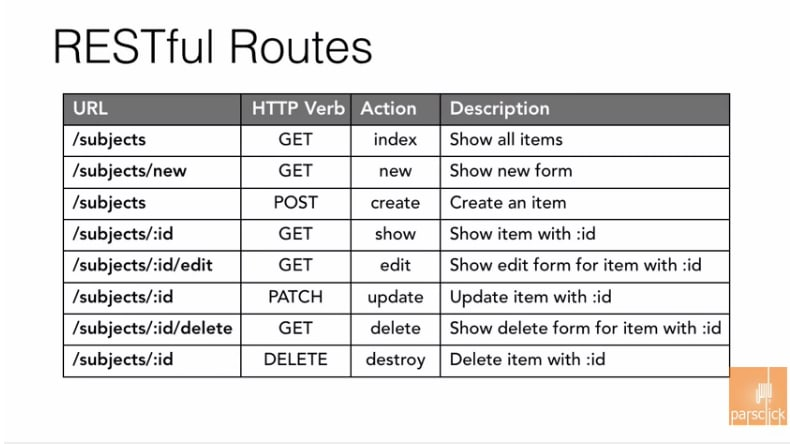

# React Router

[React Router 링크](https://reactrouter.com/)
- react router v5, v6는 문법 차이가 꽤 있다.

## 사용법
``` shellscript
$ npm install react-router-dom@6
```

- index.js에서 아래와 같이 import 해주고 BrowserRouter로 감싸준다.
``` javascript
import React from "react";
import ReactDOM from "react-dom/client";
import { BrowserRouter } from "react-router-dom";
import App from "./app";

const root = document.getElementById("root");

ReactDOM.createRoot(root).render(
  <BrowserRouter>
    <App />
  </BrowserRouter>
);
```

- App.js에서 아래와 같이 해준다.
``` javascript
import {Routes, Route, Link} from "react-router-dom";

// 중략
<Routes>
    <Route path="/" element={<Home />} />
    <Route path="/about" element={<About />} />
</Routes>
```

## useNavigate
```javascript
import {useNavigate} from 'react-router-dom';

// 중략
const navigate = useNavigate();

  const goToHomePage=()=> {
      navigate('/')
  };
// 하략
<button onClick={goToHomePage}>Go to Homepage</button>
```

## url 디자인 : RESTful Routes

- url 디자인 패턴
- HTTP Verb : Get, Post, Put, Delete
- :(colon) : parameter 값, 가변적인 값
- parameter값 받는 법
```javascript
import { useParams } from 'react-router-dom'
// 중략
const params = useParams();
```
